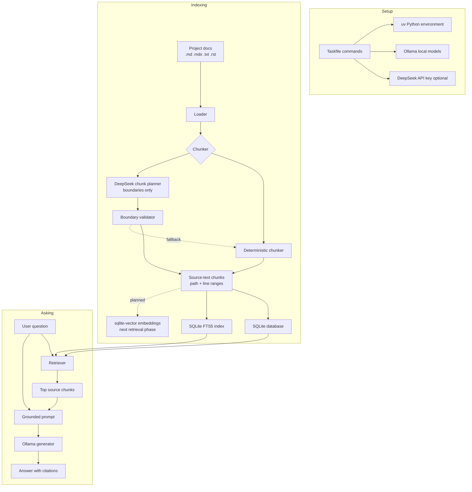

# Project Diagram

RAGLite has two main paths: indexing documentation and answering questions.

## Important Boundaries

- DeepSeek is optional and only used during indexing when `task index:deepseek` is selected.
- DeepSeek returns chunk boundaries; RAGLite still stores original source text.
- Ollama is the default answer-generation backend.
- `sqlite-vector` embedding search is the next retrieval layer after the current FTS-backed implementation.
